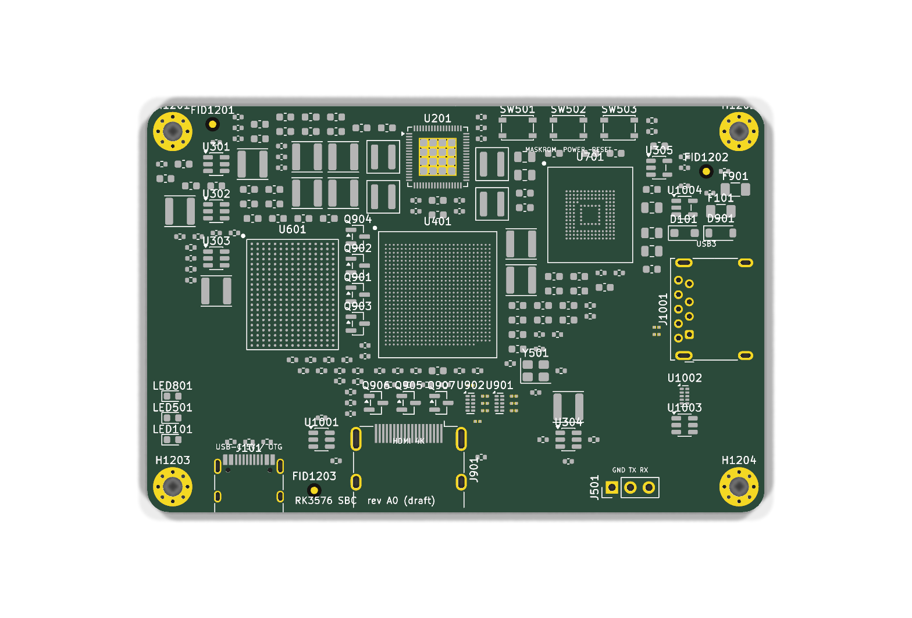

# RK3576 SBC: low-cost 8-core board with LPDDR5, eMMC, NVMe and 4K HDMI

A KiCad 9 single-board-computer design. The whole design is generated by Python from one
source file (`tools/design.py`), so the schematic, PCB, BOM and placement files cannot drift apart.

| Requirement | Implementation |
|---|---|
| 8-core processor | **Rockchip RK3576**: 4× Cortex-A72 @ 2.2 GHz + 4× Cortex-A53, Mali-G52 MC3, 6 TOPS NPU |
| LPDDR5, 4 GB to 8 GB | One **LPDDR5 x32, 315-ball** package. 4 GB `MT62F1G32D2DS` or 8 GB `MT62F2G32D4DS` in the **same footprint**, so the size is a BOM option. |
| eMMC | **eMMC 5.1 HS400, 153-ball**, 32 GB (64 GB option), boot device |
| NVMe M.2 slot | **M.2 Socket 3 M-key**, 2230/2242, PCIe 2.1 ×1 (RK3576 PCIe0) |
| 4K display out | **HDMI 2.1 TX** on a type-A connector: 4K@60 TMDS, 4K@120 FRL |
| UART out | 3-pin **debug UART0** header (GND/TX/RX, **3.3 V**, 1 500 000 8N1) |
| USB out | **USB 3.0 type-A host** (5 Gbps) + **USB-C** (5 V power in + USB2 OTG for maskrom/ADB) |
| Low price | About **$51 in parts, ~$66 per built board at 1k units** (4 GB/32 GB); ~$80 for 8 GB/64 GB. See [fab/cost_summary.md](fab/cost_summary.md). |

Also on the board: a microSD slot (recovery boot), MASKROM/POWER/RESET keys, and power/status/SSD LEDs.
The board is 85 × 56 mm (credit-card size) with an 8-layer 1.6 mm stackup.



## Status: what is done and what is not

| Stage | State | Evidence |
|---|---|---|
| Architecture, part selection, power tree | ✅ done | [docs/design_notes.md](docs/design_notes.md) |
| Schematic: 12 hierarchical sheets, 414 parts, 239 named nets | ✅ done | `kicad/*.kicad_sch`, [docs/schematic.pdf](docs/schematic.pdf) |
| ERC | ✅ **0 errors, 0 warnings** (all severities) | [fab/erc.rpt](fab/erc.rpt) |
| PCB: outline, 8-layer stackup, net classes, GND planes | ✅ done | `kicad/rk3576-sbc.kicad_pcb` |
| Component placement (floorplan) of all 414 footprints | ✅ done | renders in `docs/img/`, [docs/layout_guide.md](docs/layout_guide.md) |
| DRC + schematic↔PCB parity | ✅ **0 violations, 0 parity errors** | [fab/drc.rpt](fab/drc.rpt) |
| BOM with MPNs and cost, JLCPCB BOM, pick-and-place (CPL) | ✅ done | `fab/bom*.csv`, `fab/cpl_*.csv` |
| **Routing** (499 connections, LPDDR5/HDMI/PCIe/USB3 length-matched) | ❌ **not done** | DRC lists them as unconnected |
| **RK3576 land pattern** | ⚠️ **placeholder** | pad names come from the real 698-ball map; pad *positions* do not (see below) |
| SI/PI simulation, Rockchip HW-guide review, RK806 OTP check | ❌ not done | [docs/manufacturing.md](docs/manufacturing.md) has the release checklist |

> **Do not order boards from `fab/gerbers-draft/` yet.** Those Gerbers come from a *placed but unrouted*
> board. They exist so the fabrication flow (stackup, drills, panel review) can be checked end to end.

**Why the SoC footprint is a placeholder.** The RK3576 uses an FCCSP698L package with mixed 0.55/0.60/0.65 mm
pitch. The datasheet's pin table gives every ball *name* (all 698 are parsed into
[data/rk3576_pins.csv](data/rk3576_pins.csv) and used in the symbol). The ball *coordinates* only exist as a
drawing and in Rockchip's hardware design kit, which you get from Rockchip or a module vendor. Replace
`sbc:RK3576_FCCSP-698_16.1x17.2mm_PLACEHOLDER` with that land pattern, keeping the same pad names, and every
net assignment carries over. The LPDDR5 (315b), eMMC (153b) and M.2 footprints are built from real JEDEC
ball maps and pitches.

## Repository layout

```
hardware/sbc-rk3576/
├── tools/                  # the design source + generators (run tools/build.sh)
│   ├── design.py           # <- THE CIRCUIT: every part, pin→net, MPN, price
│   ├── gen_lib.py          # custom symbols (RK3576, LPDDR5, eMMC, RK806, M.2) + footprints
│   ├── gen_schematic.py    # hierarchical KiCad schematic (global-label style)
│   ├── gen_pcb.py          # board: stackup, outline, net classes, placement, planes
│   ├── gen_bom.py          # BOM, JLCPCB BOM, cost summary
│   ├── parse_rk3576_pins.py / extract_ref_pins.py   # pin tables from datasheets
│   └── build.sh            # regenerate + ERC + DRC/parity + fab/doc exports
├── data/                   # ball maps: RK3576 (698), LPDDR5 (315), eMMC (153), RK806 (69)
├── kicad/                  # KiCad 9 project (open rk3576-sbc.kicad_pro)
├── fab/                    # BOM, CPL, cost, ERC/DRC reports, draft Gerbers/drills
└── docs/                   # schematic PDF, assembly drawings, renders, design notes
```

## Rebuild

```bash
# KiCad 9 is needed (kicad-cli + pcbnew python). Ubuntu: ppa:kicad/kicad-9.0-releases
cd hardware/sbc-rk3576/tools && ./build.sh
```

`build.sh` fails if ERC finds anything, or if DRC/parity finds anything other than the expected
unrouted connections. Edit `design.py`, rebuild, and look at the diff.

## Tie-in to the roadmap

This is the **ECU/gateway board you would design** after learning on the Radxa A5E (Allwinner A527). It uses
the same boot-chain ideas: RK3576 BROM → SPL/TPL (DDR init blob) → U-Boot → kernel. MASKROM is Rockchip's
equivalent of sunxi FEL. The debug UART header is 3.3 V, so your USB-TTL adapter plugs straight in, at
1 500 000 baud. The 40-pin header and Ethernet were left out for cost. All free SoC balls are visible on
sheet 11 if the EC200U (UART/USB) or the Pico (I²C/SPI) need wiring in a rev B.

Interview angles this design gives you: LPDDR5 WCK/CK clocking and why x32 in one package keeps cost down,
PMIC power sequencing (S0/S3/S5 rails), AC coupling and termination on high-speed lanes, HDI vs through-via
stackups, and the BOM cost structure (the SoC and DRAM are ~70 % of parts cost). See
[docs/design_notes.md](docs/design_notes.md#interview-questions-this-board-answers).

## Sources

- RK3576 datasheet (pin list, package): [Rockchip RK3576 Datasheet V1.1](https://files.luckfox.com/wiki/Omni3576/PDF/Rockchip_RK3576_Datasheet_V1.1-20240430.pdf), [brief](https://www.rock-chips.com/uploads/pdf/2024.3.18/192/RK3576%20Brief%20Datasheet.pdf)
- Reference design: [Radxa ROCK 4D schematic V1.11](https://dl.radxa.com/rock4/4d/docs/hw/Radxa_ROCK_4D_SCH_V1.11.pdf) (RK3576 + RK806S-5 + LPDDR5 x32). The LPDDR5 315b and RK806 pin maps were taken from it.
- eMMC 153b ballout: [Alliance Memory ASFC8G31M-51BIN datasheet](https://www.alliancememory.com/wp-content/uploads/AllianceMemory_8GB_ASFC8G31M-51BIN_eMMCdatasheet_November2022_v1.3.pdf)
- LPDDR5 315b package (12.4 × 15 mm, 0.8 × 0.7 mm pitch): [Micron 315b LPDDR5 datasheet](https://www.mouser.com/datasheet/2/671/Micron_05092023_315b_y4bm_ddp_qdp_8dp_auto_lpddr5_-3175609.pdf)
